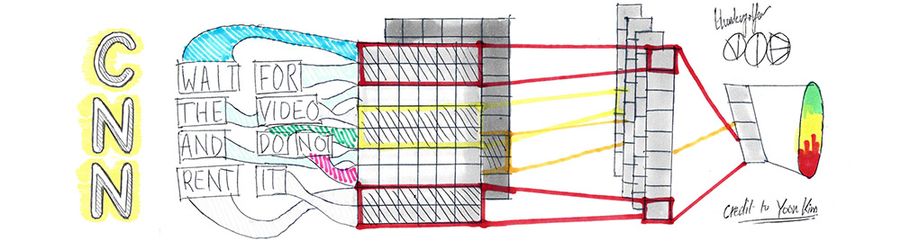
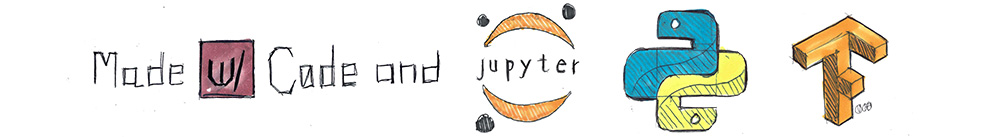

<p align="center">
  
</p>

# Text Classifying With A Convolutional Neural Network
> `python` `tensorflow` `juptyer `

Easy to follow text classifying implementation using a Conv. Neural Network (Tensorflow)

#### What You Need

1. Python 3.4 >=
2. Tensorflow >= 0.8
3. Jupyter Notebook *or* IPython Notebook [Deprecated]

### Training The Network

Training the network with Tensorflow CPU-only (2013 i7 3770K) took about **70 mins**. *Note: If you try train in Jupyter/Ipython Notebook remove all print statements in the training loop. These print statement will lock up your browser and slow things down a lot.*

To train the network on the Movie Review dataset just run:

```bash
./train.py
```

Training the network on the Customer Product Review data is

```bash
./train.py --dataset_option="products"
```


### Evaluating The Network

You first have to train the network so [see above](#training-the-network).

To evaluate the network we need to pass in some arguments to the `evaluate.py`. Run this command, replacing `checkpoint_dir` with the last savepoint of the trained model.

```shell
python evaluate.py --checkpoint_dir="runs/*some numbers*/checkpoints/"
```

or for product review dataset_option

```shell
python evaluate.py --checkpoint_dir="runs_product/*some numbers*/checkpoints/"
```

### Playing With The Network

You first have to train the network so [see above](#training-the-network).

To test out individual sentences on the network, open `experiment.ipynb` and follow instruction within the notebook.

```shell
python experiment.py --checkpoint_dir="runs/*some numbers*/checkpoints/" --sent="This is the sentence you want to test."
```

### Credit To

[Yoon Kim](https://github.com/yoonkim/CNN_sentence), [Hu and Liu - KDD-2004](https://www.cs.uic.edu/~liub/publications/kdd04-revSummary.pdf), [Denny Britz](https://github.com/dennybritz)

### Citations

*Minqing Hu and Bing Liu*. "Mining and Summarizing Customer Reviews." Proceedings of the ACM SIGKDD International Conference on Knowledge Discovery and Data Mining (KDD-2004), Aug 22-25, 2004, Seattle, Washington, USA,

<p align="center">
  
</p>
